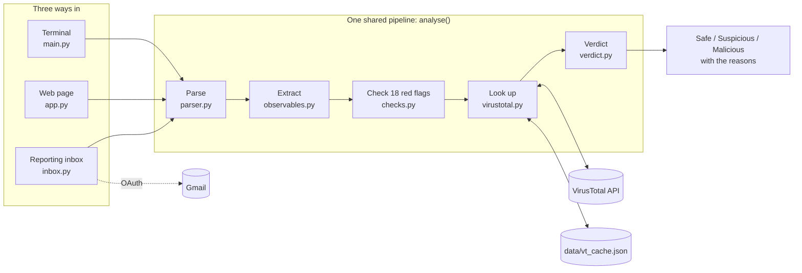

# 🎣 HookLine

A phishing email analyser. Give it a suspicious email and HookLine pulls out the links, domains, IP addresses and attachments, checks for red flags, looks the evidence up on VirusTotal, and gives a verdict, **Safe**, **Suspicious** or **Malicious**, explaining exactly why.

Use it three ways: from the **terminal**, in a **web page** with live progress, or by forwarding emails to a **reporting inbox**.

<!-- screenshot placeholder: add docs/screenshot.png to show the result page -->

## How it works

1. **Parse**: read the email and extract the headers, plain text body, HTML body and attachments
2. **Extract**: find every link, domain, IP address and email address
3. **Check**: look for 18 kinds of red flag and score each one by how strong the evidence is
4. **Look up**: optionally ask VirusTotal whether the attachments, IPs, domains and links are known to be malicious
5. **Verdict**: add up the evidence and decide: Safe (0–1 points), Suspicious (2–5) or Malicious (6+, or if 5+ VirusTotal engines agree). Things that check out, like a passing DMARC result, are listed too, but never take points off: a scammer's own domain can pass them

All three ways of using HookLine call the same `analyse()` function in `analyser/pipeline.py`, so they always give the same verdict:



For every module and how they connect, see the [detailed architecture diagram](docs/architecture.png).

## Red flags HookLine checks for

| Check | Example |
|---|---|
| SPF failed or missing | The sending server isn't allowed to send for that domain (ignored when DMARC passes) |
| DKIM or DMARC failed | The email's signature is broken, or the From address is spoofed |
| Microsoft compauth failed | Outlook and Hotmail's own verdict that the sender couldn't be confirmed |
| Reply-To mismatch | Replies go to a different organisation, or to a personal Gmail account |
| Brand mismatch | Claims to be Microsoft or Amazon but sent from a domain the brand doesn't own, even when the name is disguised |
| Look-alike domain | `paypa1.com`, `rnicrosoft.com` or `paypal-secure-login.com` dressed up as a brand's domain |
| Punycode domain | Letters from another alphabet that look like ordinary ones (`xn--...`) |
| Fake address in the name | `"service@paypal.com" <x@evil.example>`: most apps only show the name |
| Organisation on personal email | A "bank" or "support team" sending from Gmail or Hotmail |
| Spaced-out sender name | `C o i n b a s e` written letter by letter to dodge filters |
| Raw IP link | `http://33.162.119.19/pay` instead of a website name |
| Link text mismatch | The link *shows* one address but *goes* to another |
| Link shortener | Links hidden behind `bit.ly` or `tinyurl.com` so you can't see where they go |
| Form inside the email | A box to type a password into, in the email itself |
| Risky attachment | Programs like `.exe`, `.iso` or `.lnk`, double extensions like `invoice.pdf.exe`, web pages (`.html`, `.svg`) and macro documents (`.xlsm`) |
| Empty body with attachment | The body is a decoy and the real message is in the file |
| Invisible characters | Hidden characters inside words, used to disguise names like "Amazon" |
| Pressure language | "Verify within 24 hours", "account suspended", "connect your wallet", in the plain text or the HTML |

### Avoiding false alarms

Ordinary emails used to collect points for things that are normal, so real, harmless emails often came out Suspicious with 2 to 5 points. The checks now allow for:

- **Subdomains and country domains**: `news.example.com` and `example.com` are one organisation; Amazon UK sends from `amazon.co.uk`
- **DMARC passing**: it proves who sent the email, so SPF hiccups caused by forwarding and a second broken DKIM signature aren't counted, and a Reply-To elsewhere counts for less
- **Services that send for people**: a Google Calendar invite replies to the person who sent it
- **Link wrappers**: Outlook Safe Links and a company's own click tracker aren't mismatched links
- **Normal marketing words**: "limited time" and "24 hours" no longer count as pressure; the phrases are specific, like "account suspended"
- **Emoji and preview padding**: invisible characters only count inside a word, not in an emoji or between words
- **Whole words**: "Applebee's" isn't Apple
- **Weak VirusTotal answers**: one engine flagging a tracking domain is often a false alarm, so it's worth 1 point, not 2

Each of these is a test in `tests/test_checks.py`.

## VirusTotal lookups

HookLine checks attachment fingerprints (SHA-256 hashes), IP addresses, domains and links against [VirusTotal](https://www.virustotal.com), which combines the results of around 90 security engines. Attachments are never uploaded, only their fingerprints.

It's designed around the free API's limits (4 lookups a minute, 500 a day):

- **Rate limiting**: waits 15 seconds between lookups, even when several analyses run at once. After a "too many requests" answer, every lookup rests for a minute, and when the daily allowance is used up HookLine stops asking and says so, instead of making each lookup wait and fail
- **Cache**: every answer is saved in `data/vt_cache.json`, so nothing is looked up twice
- **Allowlist**: skips well-known infrastructure like Google Fonts, social media links, and webmail domains like gmail.com
- **No waste**: skips pictures shown inside the email, private IP addresses, and more than one link to the same website
- **Priority**: attachments first, then IPs, domains and links, up to 8 lookups per email
- **No double counting**: one malicious website counts once, however many links point to it
- **Clear results**: each row says why a lookup failed (no connection, daily limit, key rejected) and links to VirusTotal's full report

## Accuracy

Measured with `python -m scripts.measure_accuracy`, without VirusTotal:

| Test set | Result |
|---|---|
| 30 fake phishing emails | 30 caught |
| 50 real phishing emails ([Phishing Pot](https://github.com/rf-peixoto/phishing_pot)) | 48 caught (96%): 40 Malicious, 8 Suspicious |
| 30 fake safe emails | 30 passed, no false alarms |
| 9 realistic everyday emails (`tests/emails.py`) | 9 passed, no false alarms |

The fake samples were written alongside the checks, so their results are optimistic, and some of the newer checks were tuned while looking at the real samples, so treat those numbers as a best case too. Of the two real emails missed, one looks like genuine marketing that ended up in the collection, and the other is a loan scam sent from a real, hacked company account that passes DMARC.

The best test of false alarms is your own inbox: download some ordinary emails as `.eml` files into `samples/legit/` (it's in `.gitignore`, so they stay private) and run `python -m scripts.measure_accuracy`. Anything there that isn't Safe is listed as a false alarm, with the reasons.

## Setup

You need Python 3.14 and a free [VirusTotal account](https://www.virustotal.com).

```
git clone https://github.com/Valorz1/hookline.git
cd hookline
py -m venv .venv
.\.venv\Scripts\Activate.ps1
pip install -r requirements.txt
```

Then create a file called `.env` in the project folder:

```
VT_API_KEY=your_virustotal_key
IMAP_HOST=imap.gmail.com
IMAP_USER=your.reporting.inbox@gmail.com
```

The VirusTotal key is under your VirusTotal profile → **API key**. The `IMAP_` lines are only needed for the reporting inbox. `.env` is in `.gitignore`, so it's never uploaded.

## Use it from the terminal

```
python -m scripts.make_samples
python main.py samples/real/sample-1020.eml
```

`scripts/make_samples.py` creates 60 made-up test emails (30 phishing, 30 safe). `main.py` analyses one and shows everything it found. Here it is on a real phishing email pretending to be from Costco:

```
VIRUSTOTAL (about 15 seconds per lookup)
   domain thebandalisty.com  ->  11 malicious, 1 suspicious (of 91)
   ...

RED FLAGS (3 found, 7 points)
   [1] SPF is missing or inconclusive (spf=none)
   [4] DMARC failed: the email claims to be from costco.com, but costco.com didn't send it (spoofed)
   [2] Pressure language (2 phrases)

==================================================
VERDICT: MALICIOUS  (13 points)
==================================================
   - VirusTotal: 11 of 91 engines flag domain thebandalisty.com
   - DMARC failed: the email claims to be from costco.com, but costco.com didn't send it (spoofed)
   - Pressure language (2 phrases)
```

To skip VirusTotal and only run the quick checks, add `--no-vt`. To measure accuracy across every sample, run `python -m scripts.measure_accuracy`.

## Use it in the browser

```
python app.py
```

Then open http://127.0.0.1:5000, drop in an `.eml` file, and choose whether to check VirusTotal. To get an `.eml` file in Gmail, open the email, click the ⋮ menu, then **Download message**.

The quick checks take under a second, so the verdict appears straight away. With VirusTotal on, each lookup then fills in **live** as it finishes, using Server-Sent Events, and the verdict updates when the last one arrives.

The live connection is built to survive: the server answers at once and sends a heartbeat every 15 seconds while it waits, so nothing in between mistakes it for a dead connection. If it drops anyway, the browser reconnects by itself and the server resends only the results it missed. Lookups for a page nobody is watching any more stop after a minute, so they don't hold up the next email's.

## Use it as a reporting inbox

People forward suspicious emails **as an attachment** to a dedicated Gmail inbox, and HookLine checks them:

```
python inbox.py          analyse unread reports, leave them unread
python inbox.py --mark   analyse them, then mark them as read
```

HookLine signs in with **OAuth**, so no password is stored. To set it up:

1. Create a separate Gmail account for reports.
2. In [Google Cloud Console](https://console.cloud.google.com), create a project, enable the **Gmail API**, and set up the OAuth consent screen (External, Testing, with the reporting account as a test user and the `https://mail.google.com/` scope).
3. Create an OAuth client of type **Desktop app**, download its JSON, and save it as `credentials.json` in the `data/` folder.
4. Run `python inbox.py`. Your browser opens Google's sign-in page once; after that, the token in `data/token.json` is reused.

While the Google project is in Testing mode, the token expires after 7 days, and HookLine opens the sign-in page again.

Emails must be forwarded **as an attachment** (in Gmail: ⋮ → **Forward as attachment**). A normal forward throws away the original headers, such as the real sender and the SPF/DKIM/DMARC results, which most of the checks rely on. It's also worth adding a Gmail filter on the reporting inbox so emails with attachments are never sent to Spam.

## Security notes

HookLine handles malicious emails, so it's built to be careful with them:

- **Nothing is saved.** Uploaded emails are read in memory and discarded.
- **Nothing from the email runs.** The email's own HTML is never displayed, and everything shown on the page, including live updates, is escaped by the templates, so code hidden in a subject line can't run in your browser.
- **Attachments are never opened or uploaded.** Only their SHA-256 fingerprints are checked.
- **No mailbox password is stored.** The reporting inbox uses OAuth; the token can be revoked at any time from the Google Account's security settings.
- **Secrets stay out of Git.** `.env` and the `data/` folder (Google sign-in files and the VirusTotal cache) are in `.gitignore`.
- **The web server is for local use.** It runs in Flask's debug mode, which must never be exposed to a network.

## Roadmap

- [x] Read and parse `.eml` files
- [x] Extract links, domains, IP addresses and attachments
- [x] Red-flag checks
- [x] Brand mismatch check, including disguised names
- [x] VirusTotal lookups
- [x] Verdict scoring
- [x] Accuracy measurement on real phishing samples
- [x] Web interface
- [x] Fetch reported emails from a mailbox (IMAP)
- [x] Live progress updates in the browser
- [x] One shared analysis function for the terminal, web page and inbox
- [x] OAuth sign-in for the reporting inbox
- [x] Fewer false alarms on everyday emails
- [x] Look-alike domain, punycode, form and attachment-type checks
- [x] Sender and authentication panel, and "what checks out"
- [x] Live updates that reconnect after a dropped connection
- [x] Automated tests

## Project structure

```
hookline/
├── app.py               the web interface          python app.py
├── main.py              analyse one email           python main.py email.eml
├── inbox.py             check a reporting inbox     python inbox.py
├── analyser/            the analysis itself, shared by all three
│   ├── parser.py        read the email and its authentication results
│   ├── observables.py   find links, domains, IPs and email addresses
│   ├── domains.py       what HookLine knows about domains: webmail, brands, shorteners
│   ├── checks.py        look for red flags
│   ├── virustotal.py    VirusTotal lookups with rate limiting and caching
│   ├── verdict.py       combine the evidence into a final verdict
│   ├── pipeline.py      the one analyse() function everything uses
│   └── jobs.py          background VirusTotal jobs for the web page
├── templates/
│   ├── base.html        the parts every page shares
│   ├── index.html       the home page
│   ├── result.html      the result page
│   └── partials/        pieces included in pages, some re-sent live
│       ├── icons.svg    shared icon sprites
│       ├── upload.html  the upload form
│       ├── verdict.html the verdict banner
│       ├── vt_row.html  one VirusTotal result row
│       └── why.html     the reasons list
├── static/
│   ├── app.css          styling
│   ├── hookline.js      file picker, drag and drop, live updates
│   └── fonts/           Inter font (OFL licence)
├── scripts/             tools for development, run as python -m scripts.<name>
│   ├── measure_accuracy.py  run every sample and count the mistakes
│   ├── make_samples.py      generate the fake test emails
│   └── check_vt_key.py      one lookup, to check your VirusTotal key works
├── tests/               automated tests: python -m pytest
├── samples/
│   ├── fake/            60 generated test emails (30 phishing, 30 safe)
│   ├── real/            real phishing samples (not included, see below)
│   └── legit/           your own harmless emails, for measuring false alarms (not included)
├── data/                private, never uploaded: vt_cache.json, credentials.json, token.json
├── docs/
│   └── architecture.png detailed architecture diagram
├── run.ps1              PowerShell launcher: installs packages, starts the web page
├── .env.example         example settings: copy to .env
├── requirements.txt     packages to install
├── requirements-dev.txt packages for running the tests
├── pytest.ini           test settings
└── LICENSE              MIT licence
```

## Testing with real phishing emails

HookLine is also tested against real phishing samples from [Phishing Pot](https://github.com/rf-peixoto/phishing_pot). These aren't included in this repository because they contain live malicious links and attachments. To use them, download the collection and copy some `.eml` files into `samples/real/`.

⚠️ Only open real samples as text or with HookLine. Never double-click them or click their links.

## Running the tests

```
pip install -r requirements-dev.txt
python -m pytest
```

The tests build their own emails in code, so they don't need the real samples, and VirusTotal is replaced by a fake, so they never use your API key.

## Tech

- **Python 3.14**
- **Standard library**: `email`, `imaplib`, `re`, `html`, `hashlib`, `ipaddress`, `urllib`, `unicodedata`, `json`, `base64`, `collections`, `threading`, `queue`
- **Packages**: `flask` (web interface), `requests` (VirusTotal API), `python-dotenv` (reads settings from `.env`), `google-auth-oauthlib` (OAuth sign-in)
- **Threat intelligence**: VirusTotal public API
- **Design**: interface inspired by [Watermelon UI](https://ui.watermelon.sh) (MIT)

## Licence

MIT. See [LICENSE](LICENSE).

## Author

Built by [Valorz1](https://github.com/Valorz1)