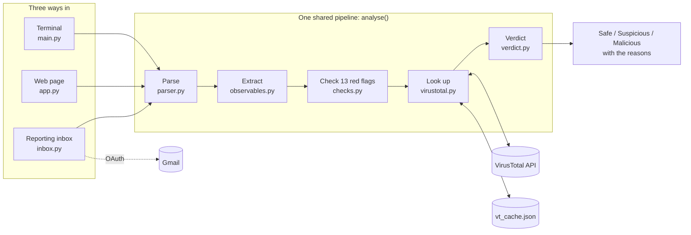

# 🎣 HookLine

A phishing email analyser. Give it a suspicious email and HookLine pulls out the links, domains, IP addresses and attachments, checks for red flags, looks the evidence up on VirusTotal, and gives a verdict, **Safe**, **Suspicious** or **Malicious**, explaining exactly why.

Use it three ways: from the **terminal**, in a **web page** with live progress, or by forwarding emails to a **reporting inbox**.

<!-- screenshot placeholder: add docs/screenshot.png to show the result page -->

## How it works

1. **Parse**: read the email and extract the headers, plain text body, HTML body and attachments
2. **Extract**: find every link, domain, IP address and email address
3. **Check**: look for 13 red flags and score each one by how strong the evidence is
4. **Look up**: optionally ask VirusTotal whether the attachments, IPs, domains and links are known to be malicious
5. **Verdict**: add up the evidence and decide: Safe (0–1 points), Suspicious (2–5) or Malicious (6+, or if 5+ VirusTotal engines agree)

All three ways of using HookLine call the same `analyse()` function in `analyser/pipeline.py`, so they always give the same verdict:



For every module and how they connect, see the [detailed architecture diagram](docs/diagram%20(1).png).

## Red flags HookLine checks for

| Check | Example |
|---|---|
| SPF failed or missing | The sending server isn't allowed to send for that domain |
| DKIM or DMARC failed | The email's signature is broken, or the From address is spoofed |
| Reply-To mismatch | Replies go to a different domain from the sender |
| Brand mismatch | Claims to be Microsoft or Amazon but sent from an unrelated domain, even when the name is disguised |
| Organisation on personal email | A "bank" or "support team" sending from Gmail or Hotmail |
| Spaced-out sender name | `C o i n b a s e` written letter by letter to dodge filters |
| Raw IP link | `http://33.162.119.19/pay` instead of a website name |
| Link text mismatch | The link *shows* one address but *goes* to another |
| Link shortener | Links hidden behind `t.co` or `tinyurl.com` so you can't see where they go |
| Risky attachment | Programs like `.exe`, `.iso` or `.lnk`, or double extensions like `invoice.pdf.exe` |
| Empty body with attachment | The body is a decoy and the real message is in the file |
| Invisible characters | Hidden characters used to disguise words like "Amazon" |
| Pressure language | "Verify within 24 hours", "account suspended", "gift cards" |

## VirusTotal lookups

HookLine checks attachment fingerprints (SHA-256 hashes), IP addresses, domains and links against [VirusTotal](https://www.virustotal.com), which combines the results of around 90 security engines. Attachments are never uploaded, only their fingerprints.

It's designed around the free API's limits (4 lookups a minute, 500 a day):

- **Rate limiting**: waits 15 seconds between lookups, even when several analyses run at once
- **Cache**: every answer is saved in `vt_cache.json`, so nothing is looked up twice
- **Allowlist**: skips well-known infrastructure like Google Fonts, and webmail domains like gmail.com
- **No images**: skips pictures shown inside the email, since nobody clicks them
- **Priority**: attachments first, then IPs, domains and links, up to 8 lookups per email
- **No double counting**: one malicious website counts once, however many links point to it

## Accuracy

Measured with `python batch.py`, without VirusTotal:

| Test set | Result |
|---|---|
| 30 fake phishing emails | 30 caught |
| 50 real phishing emails ([Phishing Pot](https://github.com/rf-peixoto/phishing_pot)) | 47 caught (94%) |
| 30 fake safe emails | 30 passed, no false alarms |

The fake samples were written alongside the checks, so their results are optimistic. The real samples are the more honest measure. Of the three real emails missed, two are Portuguese-language scams and one looks like genuine marketing that ended up in the collection.

## Setup

You need Python 3.14 and a free [VirusTotal account](https://www.virustotal.com).

```
git clone https://github.com/Valorz1/hookline.git
cd hookline
py -m venv .venv
.\.venv\Scripts\Activate.ps1
pip install -r requirements.txt
```

Then create a file called `.env` in the project folder:

```
VT_API_KEY=your_virustotal_key
IMAP_HOST=imap.gmail.com
IMAP_USER=your.reporting.inbox@gmail.com
```

The VirusTotal key is under your VirusTotal profile → **API key**. The `IMAP_` lines are only needed for the reporting inbox. `.env` is in `.gitignore`, so it's never uploaded.

## Use it from the terminal

```
python make_samples.py
python main.py samples/real/sample-1020.eml
```

`make_samples.py` creates 60 made-up test emails (30 phishing, 30 safe). `main.py` analyses one and shows everything it found. Here it is on a real phishing email pretending to be from Costco:

```
VIRUSTOTAL (about 15 seconds per lookup)
   domain thebandalisty.com  ->  11 malicious, 1 suspicious (of 91)
   ...

RED FLAGS (2 found, 4 points)
   [1] SPF is missing or only a soft fail
   [3] DMARC failed: the From domain didn't authorise this email (likely spoofed)

==================================================
VERDICT: MALICIOUS
==================================================
   - VirusTotal: 11 of 91 engines flag domain thebandalisty.com
   - DMARC failed: the From domain didn't authorise this email (likely spoofed)
   - SPF is missing or only a soft fail
```

To skip VirusTotal and only run the quick checks, add `--no-vt`. To measure accuracy across every sample, run `python batch.py`.

## Use it in the browser

```
python app.py
```

Then open http://127.0.0.1:5000, drop in an `.eml` file, and choose whether to check VirusTotal. To get an `.eml` file in Gmail, open the email, click the ⋮ menu, then **Download message**.

The quick checks take under a second, so the verdict appears straight away. With VirusTotal on, each lookup then fills in **live** as it finishes, using Server-Sent Events, and the verdict updates when the last one arrives.

## Use it as a reporting inbox

People forward suspicious emails **as an attachment** to a dedicated Gmail inbox, and HookLine checks them:

```
python inbox.py          analyse unread reports, leave them unread
python inbox.py --mark   analyse them, then mark them as read
```

HookLine signs in with **OAuth**, so no password is stored. To set it up:

1. Create a separate Gmail account for reports.
2. In [Google Cloud Console](https://console.cloud.google.com), create a project, enable the **Gmail API**, and set up the OAuth consent screen (External, Testing, with the reporting account as a test user and the `https://mail.google.com/` scope).
3. Create an OAuth client of type **Desktop app**, download its JSON, and save it as `credentials.json` in the project folder.
4. Run `python inbox.py`. Your browser opens Google's sign-in page once; after that, the token in `token.json` is reused.

While the Google project is in Testing mode, the token expires after 7 days, and HookLine opens the sign-in page again.

Emails must be forwarded **as an attachment** (in Gmail: ⋮ → **Forward as attachment**). A normal forward throws away the original headers, such as the real sender and the SPF/DKIM/DMARC results, which most of the checks rely on. It's also worth adding a Gmail filter on the reporting inbox so emails with attachments are never sent to Spam.

## Security notes

HookLine handles malicious emails, so it's built to be careful with them:

- **Nothing is saved.** Uploaded emails are read in memory and discarded.
- **Nothing from the email runs.** The email's own HTML is never displayed, and everything shown on the page, including live updates, is escaped by the templates, so code hidden in a subject line can't run in your browser.
- **Attachments are never opened or uploaded.** Only their SHA-256 fingerprints are checked.
- **No mailbox password is stored.** The reporting inbox uses OAuth; the token can be revoked at any time from the Google Account's security settings.
- **Secrets stay out of Git.** `.env`, `credentials.json` and `token.json` are all in `.gitignore`.
- **The web server is for local use.** It runs in Flask's debug mode, which must never be exposed to a network.

## Roadmap

- [x] Read and parse `.eml` files
- [x] Extract links, domains, IP addresses and attachments
- [x] Red-flag checks
- [x] Brand mismatch check, including disguised names
- [x] VirusTotal lookups
- [x] Verdict scoring
- [x] Accuracy measurement on real phishing samples
- [x] Web interface
- [x] Fetch reported emails from a mailbox (IMAP)
- [x] Live progress updates in the browser
- [x] One shared analysis function for the terminal, web page and inbox
- [x] OAuth sign-in for the reporting inbox

## Project structure

```
hookline/
├── analyser/
│   ├── __init__.py      package marker
│   ├── parser.py        read the email
│   ├── observables.py   find links, domains, IPs and email addresses
│   ├── checks.py        look for red flags
│   ├── virustotal.py    VirusTotal lookups with rate limiting and caching
│   ├── verdict.py       combine the evidence into a final verdict
│   └── pipeline.py      the one analyse() function everything uses
├── templates/
│   ├── base.html        the parts every page shares
│   ├── index.html       the home page
│   ├── result.html      the result page
│   ├── _icons.svg       shared icon sprites
│   ├── _upload.html     upload form partial
│   ├── _verdict.html    verdict banner (re-sent live)
│   ├── _vt_row.html     single VirusTotal result row (re-sent live)
│   └── _why.html        reasons list (re-sent live)
├── static/
│   ├── app.css          styling
│   ├── hookline.js      file picker, drag and drop, live updates
│   └── fonts/           Inter font (OFL licence)
├── samples/
│   ├── fake/            60 generated test emails (30 phishing, 30 safe)
│   └── real/            real phishing samples (not included, see below)
├── docs/
│   └── diagram (1).png  detailed architecture diagram
├── main.py              analyse one email from the terminal
├── app.py               the web interface
├── inbox.py             analyse emails reported to a mailbox
├── batch.py             measure accuracy across every sample
├── make_samples.py      generate the fake test emails
├── vt_test.py           a single test lookup to check your API key works
├── run.ps1              PowerShell launcher script
├── .env.example         example environment variables
├── .gitignore           files excluded from Git
├── requirements.txt     packages to install
└── LICENSE              MIT licence
```

## Testing with real phishing emails

HookLine is also tested against real phishing samples from [Phishing Pot](https://github.com/rf-peixoto/phishing_pot). These aren't included in this repository because they contain live malicious links and attachments. To use them, download the collection and copy some `.eml` files into `samples/real/`.

⚠️ Only open real samples as text or with HookLine. Never double-click them or click their links.

## Tech

- **Python 3.14**
- **Standard library**: `email`, `imaplib`, `re`, `html`, `hashlib`, `ipaddress`, `urllib`, `unicodedata`, `json`, `base64`, `collections`, `threading`, `queue`
- **Packages**: `flask` (web interface), `requests` (VirusTotal API), `python-dotenv` (reads settings from `.env`), `google-auth-oauthlib` (OAuth sign-in)
- **Threat intelligence**: VirusTotal public API
- **Design**: interface inspired by [Watermelon UI](https://ui.watermelon.sh) (MIT)

## Licence

MIT. See [LICENSE](LICENSE).

## Author

Built by [Valorz1](https://github.com/Valorz1)